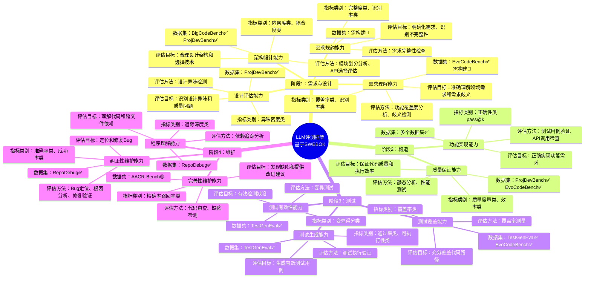

# 软件生命周期视角下的LLM细粒度评测框架 - 思维导图

## Mermaid 思维导图



## 层次结构图

```mermaid
graph TB
    A[软件生命周期LLM评测框架<br/>基于SWEBOK]

    A --> B1[阶段1：需求与设计<br/>4个能力维度]
    A --> B2[阶段2：构造<br/>2个能力维度]
    A --> B3[阶段3：测试<br/>3个能力维度]
    A --> B4[阶段4：维护<br/>3个能力维度]

    B1 --> C11[需求理解能力]
    B1 --> C12[需求规约能力]
    B1 --> C13[架构设计能力]
    B1 --> C14[设计评估能力]

    B2 --> C21[功能实现能力]
    B2 --> C22[质量保证能力]

    B3 --> C31[测试生成能力]
    B3 --> C32[测试覆盖能力]
    B3 --> C33[测试有效性能力]

    B4 --> C41[程序理解能力]
    B4 --> C42[纠正性维护能力]
    B4 --> C43[完善性维护能力]

    C11 --> D111[评估目标：准确理解领域需求]
    C11 --> D112[评估方法：功能覆盖度分析]
    C11 --> D113[指标类别：覆盖率类、识别率类]
    C11 --> D114[数据集：EvoCodeBench✅]

    C21 --> D211[评估目标：正确实现功能]
    C21 --> D212[评估方法：测试用例验证]
    C21 --> D213[指标类别：正确性类pass@k]
    C21 --> D214[数据集：多个✅]

    C31 --> D311[评估目标：生成有效测试]
    C31 --> D312[评估方法：测试执行验证]
    C31 --> D313[指标类别：通过率类]
    C31 --> D314[数据集：TestGenEval✅]

    C41 --> D411[评估目标：理解代码依赖]
    C41 --> D412[评估方法：依赖追踪分析]
    C41 --> D413[指标类别：追踪深度类]
    C41 --> D414[数据集：RepoDebug✅]

    style A fill:#e1f5ff
    style B1 fill:#fff4e6
    style B2 fill:#e8f5e9
    style B3 fill:#f3e5f5
    style B4 fill:#fce4ec
```

## 使用说明

### 方法1：在线渲染
1. 访问 https://mermaid.live/
2. 复制上面的 Mermaid 代码
3. 粘贴到编辑器中
4. 导出为 PNG/SVG

### 方法2：使用 Mermaid CLI
```bash
# 安装 mermaid-cli
npm install -g @mermaid-js/mermaid-cli

# 渲染为图片
mmdc -i 软件生命周期LLM评测框架-思维导图.md -o 思维导图.png -t default -b transparent
```

### 方法3：在 Markdown 编辑器中查看
- VSCode：安装 Markdown Preview Mermaid Support 插件
- Typora：原生支持 Mermaid
- GitHub：原生支持 Mermaid

## 图表说明

**思维导图**：展示框架的整体结构和各能力维度的关键信息
**层次结构图**：展示框架的层级关系，适合汇报演示

**颜色说明**：
- 蓝色：框架根节点
- 橙色：需求与设计阶段
- 绿色：构造阶段
- 紫色：测试阶段
- 粉色：维护阶段

**状态标识**：
- ✅ 可用：数据集已发布
- 🔴 需构建：需要自建数据集
- 🟡 部分可用：需额外处理
